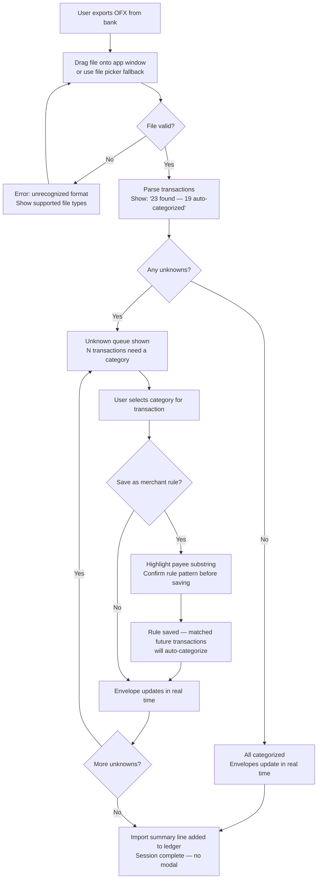
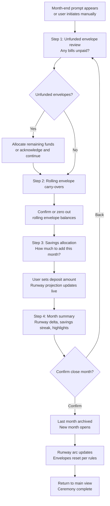
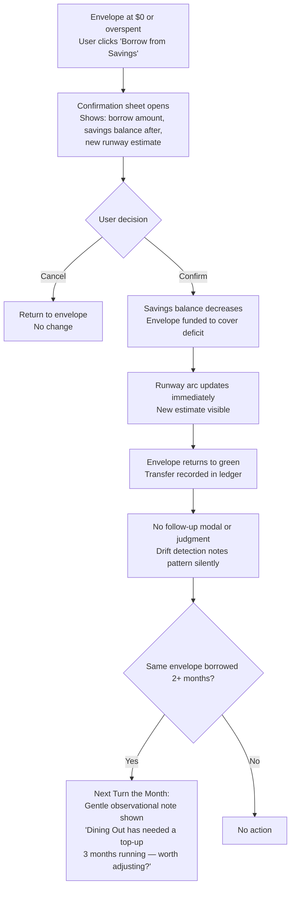
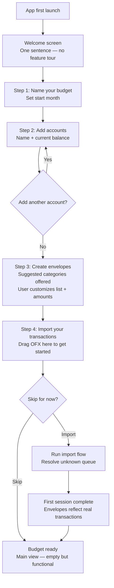

# UX Design Specification GarbanzoBeans

**Author:** Tom
**Date:** 2026-04-04

---

<!-- UX design content will be appended sequentially through collaborative workflow steps -->

## Executive Summary

### Project Vision

GarbanzoBeans is a local-first, one-time-purchase desktop budget application built as a deliberate counterpoint to subscription-based tools like YNAB. It retains the envelope budgeting methodology but shifts the north star from "did I stay in budget this month?" to "am I building a financial runway?" The product is built on the belief that the right behavior should be the easy behavior — and that the app's job is to make wealth-building visible, encouraging, and inevitable over time.

The business model is itself a product statement: no subscription, no account, no server. A one-time purchase that pays for itself in the first year.

### Target Users

**Primary user:** Tom — a current YNAB subscriber, financially aware, frustrated by annual fees and methodology-first onboarding. Wants a tool that gets out of the way, learns his patterns, and shows him whether he's actually getting ahead.

**Broader target:** Anyone in the monthly-survival loop who is ready to think beyond "did I stay in budget?" — users who want to see long-term wealth trajectory alongside day-to-day spending decisions.

**User characteristics:**
- Comfortable with desktop apps and file-based workflows (OFX export from bank)
- Financially literate but not necessarily technical
- Values ownership, privacy, and local data control
- Wants the weekly import session to feel like a small win, not a chore

### Key Design Challenges

1. **Dual time horizon on one screen** — Envelopes answer "today" (spending vs. budget), the wealth panel answers "months from now" (runway, savings trajectory). Both need to be present and readable without competing for attention.

2. **Turn the Month as ceremony, not blocker** — This mandatory guided ritual must feel like a satisfying closing ceremony. Abandonment mid-way or dread of the ritual would erode trust in the whole app.

3. **Borrow flow emotional design** — Borrowing from savings is loaded with anxiety. The UX must make users feel informed and in control — never judged. Confirmation should feel caring, not punishing.

4. **Ambient satisfaction calibration** — Color states, envelope fills, and arc gauge movement are the reward system. Too subtle and it doesn't register; too animated and it distracts. This is a tuning problem that must be built into the design language from the start.

### Design Opportunities

1. **The wealth panel as a layout differentiator** — Persistent runway + savings flow visible alongside envelope management is genuinely novel in this category. The opportunity is to make this juxtaposition feel natural and inevitable — not cluttered.

2. **The import routine as a small win** — 4 minutes, 2 unknowns resolved, everything else handled. The UX can make this routine feel rewarding rather than administrative through progressive auto-categorization feedback.

3. **Absence of SaaS noise as a design statement** — No upgrade prompts, no banners, no nags. The clean, uninterrupted interface is itself a signal of the product's values.

## Core User Experience

### Defining Experience

The heart of GarbanzoBeans is the weekly import session — a short, low-friction ritual that keeps the budget current and provides a small, ambient reward. This is the interaction the app is built around. Everything else (Turn the Month, borrow flow, onboarding) is either a supporting flow or an infrequent ritual. If the weekly session feels effortless and mildly satisfying, the app earns its permanent place in the user's routine.

The second core experience is the wealth panel — a persistent view of long-term trajectory alongside day-to-day envelope management. This is the differentiator: every allocation decision is made with runway visible. The experience principle is that wealth-building should feel inevitable, not effortful.

### Platform Strategy

- **Desktop-first, Windows 10/11 MVP** — Tauri + React, mouse and keyboard, no touch considerations
- **Fully offline** — no network calls during normal operation; auto-update check is the sole exception
- **File-based workflow** — user exports OFX from bank, drags into app; no bank integrations, no account setup
- **Single-folder data portability** — data lives where the user puts it; cloud sync is optional and handled by the OS

### Effortless Interactions

- **Import** — drag OFX in, the vast majority auto-categorizes via merchant rules; user clears a small queue of unknowns; done
- **Envelope state awareness** — every envelope has a tooltip explaining its state; no color is ever left unexplained
- **Monthly ritual** — Turn the Month is a guided step-by-step flow; no decisions to figure out independently
- **Merchant rules compound over time** — each session requires less manual input than the last; the app gets smarter without the user managing it

### Critical Success Moments

1. **First import:** User drags in OFX file, 80%+ of transactions auto-categorize, unknown queue clears in 2 minutes. The reaction should be: "Oh — that's it?"
2. **First green month:** Envelopes turn green, the runway arc advances. The feedback is ambient — no modal, no celebration pop-up — just visible state change that feels satisfying.
3. **Turn the Month completion:** Last month closes, this month opens, runway metric updates. User closes the app feeling like they accomplished something — not like they survived a workflow.
4. **Invisible merchant rules:** The moment the user realizes they didn't have to categorize anything on import. The self-teaching has crossed the threshold.

### Experience Principles

1. **The right behavior is the easy behavior** — Saving should be the default, not a discipline. The UI removes friction from good decisions and adds gentle friction to costly ones (e.g., savings borrow confirmation).
2. **Ambient reward over announced achievement** — Color, state change, and progress arc are the reward. No pop-ups, no "Good Job!" modals. Accomplishment is visible in the UI state itself.
3. **Wealth trajectory is always in frame** — The runway metric and savings flow chart are never in a report. They live next to the envelope list — visible on every session, shaping every allocation decision.
4. **The app earns trust through accuracy** — Wrong numbers destroy a financial tool instantly. Every derived value (runway, envelope balance, savings flow) must be provably correct and immediately updated after any write.
5. **Each session should be shorter than the last** — The merchant rule engine and bill date memory make the app more valuable over time. The UX should make this compounding value visible — not require the user to manage it.

## Desired Emotional Response

### Primary Emotional Goals

The dominant target feeling is **calm confidence** — not excitement or gamified dopamine, but the quiet assurance of knowing exactly where you stand financially and believing you're going to be okay. This is a deliberate inversion of the anxiety that most financial apps create by surfacing problems. GarbanzoBeans should feel like a trusted, private tool — not a coach, not a tracker, not a subscription service that needs to keep you engaged.

Secondary emotional goals:
- **Relief** — setup and routine tasks should be easier than expected
- **Quiet satisfaction** — progress and good behavior are acknowledged through ambient visual state, not announcements
- **Belonging** — the app feels like it's on your side, not judging your decisions

### Emotional Journey Mapping

| Moment | Target Feeling |
|---|---|
| First launch / onboarding | Relief — "this isn't going to take forever" |
| First import | Mild surprise — "that was it?" |
| Envelope state at-a-glance | Calm orientation — "I know where I am" |
| Envelopes turning green | Quiet satisfaction — ambient, not announced |
| Runway needle advancing | Encouragement — progress visible, not shouted |
| Turn the Month completion | Closure and readiness — ceremony feel, not chore feel |
| Rough month / borrow flow | Informed, not judged — the app is on your side |
| Returning weekly | Habit comfort — "this is my thing now" |

### Emotions to Avoid

- **Anxiety** — financial apps risk amplifying money stress; GarbanzoBeans must never pile on
- **Judgment** — borrow flows, overspend flags, and drift detection must inform, never scold
- **Overwhelm** — the wealth panel + envelope list is information-dense; layout must prevent cognitive overload
- **Distrust** — wrong numbers, stale states, or unexplained color states immediately break the emotional contract

### Design Implications

- **Calm confidence** → muted, sophisticated color palette; no alarm-red for routine overspend states; typography and spacing signal "serious tool" not "consumer app"
- **Informed, not judged** → borrow confirmation copy is supportive ("this is exactly what it's for"); drift detection language is observational, not prescriptive
- **Ambient reward** → state transitions are present but not demanding; no sound, no confetti, no badges; accomplishment lives in the UI state itself
- **Habit comfort** → the main screen layout is stable and predictable; returning users always know where everything is without re-orientation

### Emotional Design Principles

1. **The app is on your side** — every message, label, and confirmation dialog is written from a perspective of support, not surveillance
2. **Reward through state, not announcement** — green envelopes, advancing arc, and filled bars are the celebration; no modals required
3. **Inform before you act, not after** — borrow confirmation, Turn the Month summary, and drift detection all give information *before* the user commits, not as post-hoc warnings
4. **Clarity eliminates anxiety** — every number has a source, every color has a tooltip, every state is explainable; opacity is the enemy of calm

## UX Pattern Analysis & Inspiration

### Inspiring Products Analysis

**Copilot (Mac/iOS)**
The aesthetic benchmark cited in the PRD. Notable for premium visual language — clean information hierarchy, breathing room that signals quality, and financial data presented beautifully without being decorative. Key lesson: *data can be beautiful without sacrificing legibility or density*.

**YNAB (direct predecessor)**
The app GarbanzoBeans replaces. Despite its weaknesses, YNAB's envelope/category list as the home screen is a correct UX decision — not a dashboard of charts, but the working surface itself. Key lesson: *the category list is the product; don't bury it inside a dashboard*.

**Linear (cross-category reference)**
The gold standard for desktop-class software that is both powerful and beautiful. Dense information, typography-first design, no wasted space, keyboard-aware. Key lesson: *financially literate adults are power users — design for density and precision, not simplicity*.

**Actual Budget (philosophical sibling)**
Local-first, one-time purchase — closest to GarbanzoBeans philosophically, but with rough UX. Key lesson: *what not to carry over* — generic component styling, cramped layout, no visual language for financial health status.

### Transferable UX Patterns

**Navigation & Layout:**
- Category list as the primary home surface (YNAB) — the envelope list is the working screen, not a sub-view
- Persistent contextual panel alongside the main list (various) — wealth panel always present, never buried in reports

**Visual Design:**
- Typography-driven hierarchy (Linear) — section headers, amounts, and labels carry meaning through weight and size, not just color
- Breathing room as quality signal (Copilot) — generous spacing and subtle dividers communicate "premium" without decoration
- Muted, purposeful color (Copilot/Linear) — color reserved for state and signal, not decoration

**Interaction:**
- Keyboard-first for power paths (Linear) — import, allocation, and navigation should have keyboard shortcuts for experienced users (post-MVP)
- Inline editing over modal dialogs where possible — envelope allocation, transaction categorization should feel immediate

### Anti-Patterns to Avoid

- **Dashboard-of-widgets** (Mint, Monarch Money) — home screen as a grid of charts diffuses focus; GarbanzoBeans has one main screen
- **Celebration modals** — pop-ups for staying in budget feel condescending to financially literate adults; ambient state is the reward
- **Methodology onboarding** (YNAB) — do not explain the system philosophy before letting the user use the tool
- **Upgrade prompts and feature-gating UI** — the absence of SaaS noise is a design statement; never break the clean surface
- **Generic component defaults** (Actual Budget) — shadcn/ui out-of-the-box is recognizable; every component must be themed against the custom design system before any screen ships

### Design Inspiration Strategy

**Adopt directly:**
- Category list as home screen (YNAB's correct instinct)
- Typography-driven hierarchy and dense-but-breathing layout (Linear)
- Color reserved for state signals, not decoration (Copilot)

**Adapt for GarbanzoBeans:**
- Copilot's premium visual language → desktop-optimized; more data density than mobile allows
- Linear's keyboard-first philosophy → plan the shortcut model now; implement post-MVP
- YNAB's envelope familiarity → retain the mental model, replace the aesthetic and the focus

**Explicitly avoid:**
- Any pattern that requires a modal to deliver positive feedback
- Any layout that buries the wealth panel behind a navigation action
- Any component that ships with its shadcn/ui default appearance

## Design System Foundation

### Design System Choice

**shadcn/ui + Tailwind CSS, fully themed as a custom design system.**

shadcn/ui provides the component foundation — accessible, composable, and not opinionated about visual style in the way that Material UI or Ant Design are. Tailwind CSS provides the styling layer. Together, they are the correct substrate for a custom-feeling desktop app without building components from scratch.

This is a Themeable System approach: proven component behavior and accessibility baked in; visual identity entirely custom.

### Rationale for Selection

- **Already decided in architecture** — stack is fixed; shadcn/ui + Tailwind is the confirmed choice
- **Maximum visual control** — shadcn/ui ships unstyled primitives; the "look" is entirely what we define, not what the library defaults to
- **Accessibility included** — Radix UI primitives under the hood handle focus management, keyboard navigation, and ARIA without custom implementation
- **Tailwind makes design tokens practical** — CSS custom properties + Tailwind config = a single source of truth for every color, size, and radius decision
- **Recharts integrates cleanly** — the arc gauge and savings flow chart use Recharts, which accepts Tailwind-compatible color values directly

### Implementation Approach

- **Phase 0 (pre-implementation):** Define the full design token set — color palette (including traffic-light states), typography scale, spacing system, border radius, shadow levels. Tom approves before any screen is built.
- **Phase 1:** Apply tokens to shadcn/ui component themes — Button, Card, Badge, Input, Dialog, Tooltip, and Select variants all get GarbanzoBeans-specific styling.
- **Phase 2:** Build custom components (envelope card, arc gauge, savings flow chart, fuel gauge needle) on top of the same token system.
- **Rule:** No component ships with its shadcn/ui default appearance. If it looks generic, it hasn't been themed yet.

### Customization Strategy

- **Color system:** Semantic tokens (e.g., `--color-envelope-green`, `--color-envelope-orange`, `--color-envelope-red`, `--color-runway-caution`, `--color-savings-positive`) map to a base palette. Traffic-light colors are muted/desaturated versions of pure green/orange/red — sophisticated, not garish.
- **Typography:** A single type scale covering heading, body, label, and numeric display variants. Financial amounts get a dedicated numeric style (tabular figures, consistent weight).
- **Spacing:** 4px base unit, consistent across all components.
- **Dark mode:** Ships in MVP alongside light mode. Both themes are designed simultaneously. Default follows OS preference (`prefers-color-scheme`); user can override in Settings. CSS custom properties carry both color sets — light values in `:root`, dark values in `@media (prefers-color-scheme: dark)` and `[data-theme="dark"]`. Tauri reads OS preference at launch; settings toggle writes `data-theme` to the root element.
- **Tom's approval gate:** Design token decisions (palette, type, radius) are presented as visual swatches before implementation begins — not described in text, shown as rendered examples.

## Core User Experience Definition

### Defining Experience

**"Import your transactions and watch the budget update itself."**

The core interaction is the weekly import session: drop an OFX file, watch the merchant rule engine auto-categorize the majority of transactions, clear a short queue of unknowns, and close the app. Done. The budget reflects reality.

This is the interaction GarbanzoBeans is built around. The merchant rule engine makes it progressively shorter each week — after the first month of use, most import sessions require clearing 2–3 unknowns at most. The defining emotional moment is the first time the user realizes they didn't have to teach the app anything: it already knew.

### User Mental Model

Users coming from YNAB arrive with a trained expectation: budgeting requires work. They're accustomed to manually entering transactions, reconciling against statements, and re-teaching merchant categories repeatedly.

GarbanzoBeans needs to create a **mental model shift**: from *budget-as-work* to *budget-as-glance*. The import session is fast not because it's been over-simplified — because the app has learned the user's financial life and applies that knowledge automatically.

Key mental model elements to respect:
- Envelope metaphor is already understood by YNAB users — don't reinvent it
- Cleared vs. uncleared balance is familiar — preserve the dual-balance ledger concept
- Category assignment is expected — the difference is that most are pre-assigned

### Success Criteria

- **First import:** under 5 minutes from OFX file drop to closed app
- **Return import** (after merchant rules established): under 3 minutes
- Unknown queue is processed without the user needing to think about *how* — next action is always obvious
- Envelope states update visibly as transactions process — the budget reflects reality before the user closes the import view
- After 4 weeks of use: the user notices they're clearing fewer unknowns each session without having done anything deliberate to cause this

### Novel UX Patterns

**Established patterns used:**
- File drop zone → transaction list (familiar from any import workflow)
- Category picker per transaction (familiar from YNAB and similar tools)
- Dual cleared/working balance ledger (familiar to YNAB users)

**Novel patterns requiring thoughtful design:**

1. **Substring rule creation** — selecting part of a payee name to define a merchant matching pattern. Interaction model: text selection (familiar) → "Save as rule" prompt → rule applied to future imports (novel payoff). Must feel like a natural extension of the selection gesture, not a separate settings workflow.

2. **Ambient envelope update during import** — envelope cards update in the background as transactions are auto-categorized, without a required "apply" step. The budget stays current while the user works through the unknown queue. This removes the "save changes" mental overhead but must be visually clear that updates are happening.

### Experience Mechanics

**Initiation:**
- User exports OFX from bank, drags file onto the app window (or uses a file picker button as fallback)
- App immediately shows transaction count and begins processing: "23 transactions found — 19 auto-categorized"

**Interaction:**
- Auto-categorized transactions are shown in a collapsed summary (expandable for review)
- Unknown merchant queue is presented one at a time or as a scannable list
- For each unknown: user selects a category; optionally selects payee substring to save as a rule
- Substring selection uses a text highlight interaction on the payee name; matched pattern is shown before saving

**Feedback:**
- Transaction counter decrements as unknowns are resolved
- Envelope cards update in real time as transactions are committed
- Matched rule shown inline on auto-categorized transactions: "→ Groceries via Kroger rule"
- No completion modal — the queue simply empties; the last transaction resolves and the import view closes or collapses naturally

**Completion:**
- Unknown queue reaches zero
- Import summary line appears in ledger header: "Import — Oct 12 — 23 transactions"
- Envelope states reflect the updated budget; user can review or close

## Visual Design Foundation

### Color System

**Selected palette: Dark Forest (MVP — approved 2026-04-04)**

YNAB-inspired structure: dark forest green sidebar as navigation chrome, neutral near-black content area, lime as the active/funded signal color. The green identity lives in the sidebar; the canvas stays neutral so semantic state colors read with full clarity.

**Base palette:**

| Name | Hex | Role |
|---|---|---|
| Forest Deep | `#0F2218` | Sidebar background |
| Neutral Black | `#111214` | App window background |
| Neutral Surface | `#1C1E21` | Card and panel surfaces |
| Lime | `#C0F500` | Active nav, funded state, primary interactive |
| Amber | `#F5A800` | Caution / partially funded |
| Red | `#ff5555` | Overspent / danger |

**Semantic design tokens:**

| Token | Value | Usage |
|---|---|---|
| `--color-bg-app` | `#111214` | App window background |
| `--color-bg-surface` | `#1C1E21` | Card and panel surfaces |
| `--color-bg-sidebar` | `#0F2218` | Navigation sidebar |
| `--color-text-primary` | `#EEEEF0` | Body text, labels |
| `--color-text-secondary` | `#888A90` | Secondary labels, hints |
| `--color-border` | `#26282C` | Dividers, card borders |
| `--color-sidebar-text` | `rgba(255,255,255,0.65)` | Sidebar nav item text |
| `--color-sidebar-active` | `#C0F500` | Active sidebar item, logo |
| `--color-sidebar-hover` | `rgba(255,255,255,0.07)` | Sidebar hover state |
| `--color-envelope-green` | `#C0F500` | Funded / healthy state |
| `--color-envelope-green-bg` | `rgba(192,245,0,0.13)` | Funded card background tint |
| `--color-envelope-orange` | `#F5A800` | Caution / partially funded |
| `--color-envelope-orange-bg` | `rgba(245,168,0,0.13)` | Caution card background tint |
| `--color-envelope-red` | `#ff5555` | Overspent / unfunded |
| `--color-envelope-red-bg` | `rgba(255,85,85,0.13)` | Overspent card background tint |
| `--color-savings-positive` | `#90c820` | Savings flow positive bars |
| `--color-savings-negative` | `#ff5555` | Savings drawdown bars |
| `--color-runway-healthy` | `#C0F500` | Runway arc green zone (3+ months) |
| `--color-runway-caution` | `#F5A800` | Runway arc amber zone (1–3 months) |
| `--color-runway-critical` | `#ff5555` | Runway arc red zone (<1 month) |
| `--color-gauge-track` | `#26282C` | Runway arc background track |
| `--color-interactive` | `#C0F500` | Buttons, links, focus rings |

**Color principles:**
- Green identity lives in the sidebar chrome only; the content canvas is neutral so state signals are unambiguous
- Lime `#C0F500` is the single positive signal — funded envelopes, active nav, healthy runway, savings growth
- Amber and red are vivid on the dark neutral surface; no muting needed at this darkness level
- Light mode is deferred post-MVP; the full token set maps to a light theme when needed

### Typography System

**Primary typeface: Roboto**

Roboto is the correct choice for a desktop financial tool: designed for screen legibility, excellent tabular numeral support (critical for aligned financial columns), and familiar enough to feel immediately trustworthy.

**Type scale:**

| Level | Size | Weight | Usage |
|---|---|---|---|
| Display | 28px | 700 | Primary financial amounts (runway number, account balance) |
| Heading 1 | 20px | 600 | Screen titles, section headers |
| Heading 2 | 16px | 600 | Card headers, envelope names |
| Body | 14px | 400 | Transaction descriptions, labels |
| Label | 12px | 500 | Metadata, dates, badge text |
| Caption | 11px | 400 | Tooltips, helper text |

**Numeric display rule:** All financial amounts use `font-variant-numeric: tabular-nums` to ensure column alignment in ledger and envelope views. Primary amounts (balances, totals) use Display weight 700.

**Line height:** 1.5 for body, 1.2 for headings and financial display values.

### Spacing & Layout Foundation

**Base unit: 4px**

All spacing, padding, and gap values are multiples of 4px. Standard increments: 4, 8, 12, 16, 24, 32, 48, 64px.

**Layout approach — Desktop-optimized two-panel:**
- Left: fixed-width sidebar (navigation, ~220px)
- Center/Right: main content area split between envelope list and wealth panel
- Wealth panel: persistent top section of the main area (~220px height, collapsible)
- Envelope list: fills remaining vertical space, scrollable

**Density target:** Comfortable but not spacious. Envelope cards have enough internal padding to be tappable (even though it's desktop), but the list should show 8–12 envelopes without scrolling on a standard 1080p display.

**Border radius:** 8px for cards; 4px for inputs and badges; 0px for layout containers. Subtle rounding signals "friendly tool" without feeling like a consumer mobile app.

**Shadow:** Single elevation level only — a soft, warm-tinted box shadow for floating elements (dialogs, dropdowns). Cards use border, not shadow, to avoid visual noise in dense lists.

### Accessibility Considerations

- **Text contrast:** All text tokens must meet WCAG AA (4.5:1 for body, 3:1 for large text). `#EEEEF0` on `#111214` exceeds this requirement; verify all extended tokens before implementation.
- **Semantic color:** Traffic-light states (green/orange/red) are never communicated by color alone — each envelope state also has a tooltip explaining the state in text.
- **Focus states:** Lime `#C0F500` focus ring (2px, 2px offset) on all interactive elements in the content area; white focus ring on sidebar items for contrast against the dark green.
- **Font size minimum:** 11px caption is the floor; no text below this size in the shipped app.
- **Numeric alignment:** Tabular figures ensure ledger columns are readable without relying on visual scanning.

## Design Direction Decision

### Design Directions Explored

Three visual directions were evaluated via an interactive HTML showcase, all built on the YNAB-inspired structural principle of dark sidebar chrome against a neutral content area:

- **Direction 1 — Light Mode:** Deep forest green sidebar (`#1B3B27`) against a clean neutral off-white (`#F5F5F3`). Green identity lives in the chrome; the canvas stays colorless so state signals read cleanly.
- **Direction 2 — Dark Forest:** Near-black app background (`#111214`) with a deeper forest green sidebar (`#0F2218`). The darker sidebar creates more visual separation from the neutral content area. Lime pops with maximum contrast.
- **Direction 3 — Dark Neutral:** Same dark green sidebar (`#1B3B27`) against a lighter neutral near-black (`#18181A`). Less contrast between chrome and canvas; more familiar as a dark mode pattern.

### Chosen Direction

**Direction 2 — Dark Forest** (MVP)

Sidebar: `#0F2218` · App BG: `#111214` · Surface: `#1C1E21` · Accent: `#C0F500`

Light mode is deferred post-MVP. The full token set is designed to map to a light theme when that work begins.

### Design Rationale

The Dark Forest direction was selected for three reasons:

1. **Maximum signal clarity** — The neutral near-black canvas gives lime, amber, and red their full contrast range. No background hue competes with envelope state colors.
2. **Green identity without noise** — The sidebar is deep enough to carry the green brand identity without the content area needing to repeat it. The color earns its moment in the chrome.
3. **Precedent and trust** — The YNAB structural model (dark nav, neutral content) is already familiar to the primary user. Switching the hue from navy to forest green is distinctive without being disorienting.

### Implementation Approach

All design tokens are defined in the approved semantic token set in the Visual Design Foundation section. The design direction HTML file (`ux-design-directions.html`) serves as the living reference for visual decisions not captured in token values — spacing, hover states, component feel, and layout proportions.

## User Journey Flows

### Weekly Import Session

The defining interaction. Every design decision should serve this flow's speed and ambient satisfaction.

### Turn the Month

A guided multi-step ritual. The user should finish feeling like they closed something — not like they survived a workflow.

### Borrow from Savings

Emotionally sensitive. The app is on the user's side — inform before they act, never judge after.

### First Launch / Onboarding

Get to value fast. No methodology lecture. The goal is a first import within the first session.

### Journey Patterns

**Navigation:**
- Guided multi-step flows (Turn the Month, Onboarding) use a linear step model with a visible back affordance — users can always reverse without losing work
- The main budget view is always one action away from any flow; no flow traps the user

**Decision points:**
- Confirmation dialogs only appear for consequential, hard-to-reverse actions: closing a month, borrowing from savings
- All other actions (categorize, allocate, create rule) are immediate and undoable
- Default option is always the safe/reversible path

**Feedback:**
- Envelope cards update in real time as transactions are committed — there is no "save" or "apply" step
- The runway arc updates immediately on any savings event
- Flows end naturally (queue empties, step counter reaches final step) rather than with a completion modal
- Merchant rule confirmation is inline, not a separate settings screen

### Flow Optimization Principles

1. **Every flow should be shorter than the last** — merchant rules compound; Turn the Month gets faster as patterns stabilize; the app learns so the user doesn't have to manage it
2. **Inform before the action, not after** — borrow confirmation, Turn the Month summary, and drift nudges all give information *before* the user commits
3. **Ceremony over transaction** — Turn the Month is the one flow that should feel substantial; all other flows should minimize steps to completion
4. **No orphaned states** — every error path (invalid file, unfunded envelope, cancelled borrow) returns the user to a clear, known state with no residual confusion

## Component Strategy

### Design System Components

**shadcn/ui covers these needs out of the box (theming required, no custom build):**

| Component | Usage in GarbanzoBeans |
|---|---|
| Button | Primary actions: confirm borrow, close month, save rule, import |
| Card | Wealth panel sections, settings panels |
| Dialog | Borrow confirmation sheet, destructive action confirmations |
| Input | Account names, envelope names, budget amounts |
| Select | Category picker in import unknown queue |
| Badge | Envelope state labels (Funded, On track, Due Oct 22, Over budget) |
| Tooltip | Required on every color-coded state — color is never the sole signal |
| Separator | Wealth panel dividers, envelope group dividers |
| Progress | Envelope fill bar (budget used vs. allocated) |

**Rule:** Every one of these ships themed against the Dark Forest token set before any screen is built. No default shadcn/ui appearance reaches a user.

### Custom Components

#### Envelope Card

**Purpose:** The primary repeating unit of the budget view. Communicates envelope name, spend progress, state, and amount at a glance.

**Anatomy:** State bar (4px left edge, color-coded) · Envelope name · Progress bar (56px wide, 3px tall) · Amount display · State badge

**States:**
- `funded` — lime state bar and badge, full or near-full progress
- `on-track` — lime, partial progress
- `caution` — amber, low or zero progress, with due date badge
- `overspent` — red, overflowed progress bar, negative amount in red
- `hover` — subtle opacity shift, no layout change

**Accessibility:** `role="button"`, `aria-label="[Envelope name]: [state], [amount]"`, keyboard focusable, tooltip on state badge explaining color meaning in text

---

#### Arc Gauge (Runway Meter)

**Purpose:** Displays months of financial runway as a semicircular arc. The single most important data visualization in the app.

**Anatomy:** SVG semicircle track (3 colored zones: red / amber / lime) · Filled arc showing current runway · Center number (months, Display weight) · "months runway" label below

**States:**
- `healthy` — arc fills into lime zone (3+ months)
- `caution` — arc in amber zone (1–3 months)
- `critical` — arc in red zone (<1 month)

**Behavior:** Arc fill animates on update (Turn the Month, savings deposit). Delta indicator (↑ +0.3 this month) appears below.

**Built with:** SVG paths; color values from design tokens

---

#### Savings Flow Chart

**Purpose:** Bar chart showing monthly savings deposits/withdrawals over the last 6 months. Provides the "am I trending right?" answer at a glance.

**Anatomy:** 6 vertical bars (positive = lime-dim, negative = red, current month = lime) · Month label below · No axes or gridlines — bars carry the meaning

**Built with:** Recharts BarChart, accepting design token color values

---

#### Import Drop Zone

**Purpose:** Entry point for the weekly import session. Accepts OFX file drag-and-drop or click-to-browse.

**States:**
- `idle` — dashed border, "Drag your OFX file here" label
- `drag-over` — border becomes lime, background tint appears
- `processing` — spinner + "Parsing 23 transactions…"
- `complete` — transitions to import results view
- `error` — red border, error message, retry affordance

---

#### Unknown Queue Item

**Purpose:** One transaction in the import unknown queue. User assigns a category and optionally creates a merchant rule.

**Anatomy:** Payee name (interactive for substring selection) · Date · Amount · Category select (shadcn/ui Select, themed) · "Save as rule" toggle

**Interaction:** Payee name text is selectable; highlighting a substring shows the pattern preview ("Kroger → Groceries") before confirming the rule. This is the novel interaction that makes the rule builder feel like a natural extension of categorization, not a separate settings workflow.

---

#### Substring Rule Builder

**Purpose:** Inline within Unknown Queue Item. Lets the user define a merchant matching rule by highlighting part of the payee name.

**Anatomy:** Payee text rendered as interactive spans · Highlighted selection shown with lime background · "Match: [pattern]" preview · Save / dismiss

**Behavior:** Selection gesture (mouse drag or keyboard) highlights characters; the matched pattern is shown live before saving; rule is confirmed inline, no modal

---

#### Turn the Month Stepper

**Purpose:** Shell component for the guided month-closing ritual. Wraps content steps in a consistent frame with progress indicator and back/forward affordances.

**Anatomy:** Step counter ("Step 2 of 4") · Step title · Content slot · Back button · Continue/Confirm button

**States:** Each step slot is filled by a different content component (unfunded review, carry-over table, savings input, summary). The stepper shell itself is stateless — it just provides navigation and structure.

---

#### Savings Card

**Purpose:** A visually distinct variant of the envelope card for the savings account row. Communicates deposit status and streak rather than spend vs. budget.

**Anatomy:** "SAVINGS" label (lime, uppercase) · Account name · Deposit status ("↓ $300 deposited") · Streak indicator ("3-month streak")

**Distinction from Envelope Card:** No progress bar, no state badge — savings is not a spend envelope. Lime border tint distinguishes it visually from regular envelopes.

### Component Implementation Strategy

- All custom components consume design tokens exclusively — no hardcoded hex values in component files
- Custom components live in `src/components/gb/` to distinguish them from themed shadcn/ui components in `src/components/ui/`
- Every component has a tooltip variant or `aria-label` that communicates state in text — color is never the sole signal
- Recharts is the charting library for Arc Gauge and Savings Flow Chart; color values passed as props from the token system

### Implementation Roadmap

**Phase 1 — Core (needed for weekly import session):**
- Envelope Card — the app doesn't function without it
- Import Drop Zone — entry point for the core experience
- Unknown Queue Item — resolves the import session
- Arc Gauge — wealth panel must be visible from session 1
- Savings Flow Chart — wealth panel completeness

**Phase 2 — Monthly ritual (needed for Turn the Month):**
- Substring Rule Builder — the compounding value mechanic
- Turn the Month Stepper — the ceremony shell
- Savings Card — savings row in envelope list

**Phase 3 — Polish (post-MVP):**
- Animated state transitions on envelope cards (arc fill, progress bar updates)
- Keyboard shortcut layer for import queue (j/k navigation, enter to confirm)

## UX Consistency Patterns

### Button Hierarchy

**Primary (filled, lime background, dark text):**
Used for the single most important action in any given context. Only one primary button per view.
- "Confirm" in borrow dialog
- "Close Month" in Turn the Month final step
- "Start Import" on the import drop zone

**Secondary (outlined, lime border, lime text):**
Used for significant but non-destructive actions that share a screen with a primary button.
- "Save Rule" alongside category assignment
- "Add Envelope" in the envelope list

**Ghost (no border, muted text):**
Used for low-stakes, reversible, or escape actions.
- "Cancel" in any dialog
- "Skip for now" in onboarding
- "Back" in multi-step flows

**Destructive (red outlined):**
Reserved for irreversible deletions only. Not used for financial actions (those are confirmations, not destructive).
- "Delete envelope" in settings
- "Remove account"

**Rule:** No button uses a generic gray default. Every button variant maps to a token-defined style.

### Feedback Patterns

**Positive outcomes — ambient only, no modals:**
- Funded envelopes transition to lime state bar and badge
- Runway arc advances — no text, no sound, just visible state change
- "3-month streak" appears on Savings Card — no congratulations popup
- Import completes — queue empties naturally, summary line appears in ledger

**Neutral information — inline, not intrusive:**
- "23 transactions found — 19 auto-categorized" appears as a header above the queue, not a modal
- "Matched via Kroger rule" appears inline on auto-categorized transactions
- Month-end prompt is a persistent but non-blocking banner, not a dialog

**Caution — informational, not alarming:**
- Envelope enters caution state: amber state bar + badge with due date
- Drift detection: plain-language note in Turn the Month summary step, not a standalone alert
- Low runway (1–3 months): arc moves into amber zone — tooltip explains, no modal

**Error — clear, recoverable, non-judgmental:**
- Invalid OFX file: inline error on drop zone with clear message + retry affordance
- Overspent envelope: red state bar + badge, negative amount shown in red — tooltip explains the state in text
- Failed save: inline error below the affected field, not a toast

**What GarbanzoBeans never does:**
- Celebration modals ("Great job staying in budget!")
- Toast notifications for positive outcomes
- Red alarm states for routine financial situations (overspend is informational, not an emergency)
- Persistent notification badges or unread counts

### Form Patterns

**Amount inputs:**
- Always right-aligned, tabular figures, `$` prefix
- Increment/decrement via scroll or arrow keys
- Validation is on blur, not on keystroke — don't interrupt while typing
- Invalid state: red border + inline message below field, no modal

**Category picker (import queue):**
- shadcn/ui Select, themed — opens inline, not in a separate modal
- Most recently used categories float to top
- Keyboard navigable: arrow keys, enter to select, escape to dismiss

**Inline editing (envelope names, amounts):**
- Single click activates edit mode on the field
- Enter or blur confirms; Escape cancels
- No explicit "Edit" button — the field itself is the affordance

**Multi-step forms (Turn the Month, Onboarding):**
- One decision per step — never ask two unrelated things on the same step
- Step counter visible at all times ("Step 2 of 4")
- Back always available and non-destructive (no data loss)
- Progress is saved as the user moves forward — returning to a step shows their prior answer

### Navigation Patterns

**Sidebar active state:**
- Active item: lime text + subtle background tint (`rgba(255,255,255,0.09)`)
- Hover: same background tint, no text color change
- Focus ring: white 2px outline on dark green sidebar background
- Section labels (TOOLS) are non-interactive — 35% white opacity, no hover state

**In-flow navigation:**
- Sidebar remains visible but de-emphasized during active flows
- No "are you sure you want to leave?" interrupts — data is saved progressively; leaving a flow is always safe

**No breadcrumbs:** The app is shallow (main view + overlays). Breadcrumbs add no value at this depth.

### Overlay and Dialog Patterns

**Confirmation dialogs (consequential actions only):**
Used for: borrow from savings, close month, delete envelope/account.

- Title: states what will happen, not a question ("Borrow $80 from Savings")
- Body: consequences the user needs before deciding (new savings balance, new runway estimate)
- Copy tone: supportive, not warning ("This is exactly what it's for")
- Actions: primary confirm (lime) + ghost cancel — cancel is always on the left

**Guided flow overlays (Turn the Month, Onboarding):**
- Full-screen overlays, not modals — the user is in a distinct mode
- Step progress always visible
- Escape key does not dismiss — must use explicit Back/Cancel to prevent accidental dismissal

**Tooltips:**
- Triggered on hover, 300ms delay
- Every color-coded state has a tooltip explaining the state in plain text
- Max width: 240px; appear above by default, flip below if clipped

### Empty and Loading States

**Empty envelope group:** Group label + dimmed "Add envelope" row. No illustration or marketing copy.

**First launch:**
- Suggested categories shown greyed out at $0
- Wealth panel shows arc at center with "—" instead of a number
- Import drop zone prominently displayed

**Import processing:**
- Drop zone transitions to spinner + "Parsing [N] transactions…"
- Envelope cards begin updating as transactions process — live update is the feedback
- If parsing >2s: subtle indeterminate progress indicator

**App startup:** Last known state renders immediately from local data. If read >500ms: skeleton matching envelope card layout — never a blank screen.

## Responsive Design & Accessibility

### Responsive Strategy

GarbanzoBeans is a desktop-first, desktop-only application for MVP. Responsive strategy means graceful behavior across Windows desktop window sizes — from a snapped half-screen at ~900px wide to a maximized 4K display.

**Minimum supported size:** 1024×600px

**Design target:** 1920×1080 (1080p — the baseline for all mockups and component specifications)

**Layout behavior at key widths:**

| Width | Behavior |
|---|---|
| <1024px | Sidebar collapses to icon-only (48px). Wealth panel stacks vertically. |
| 1024–1280px | Full sidebar visible. Wealth panel compressed — arc gauge and savings chart share a tighter row. |
| 1280–1920px | Default layout. All elements at designed proportions. |
| >1920px | Content area caps at max-width; sidebar remains fixed. No stretching to fill ultra-wide. |

**Sidebar:** Fixed-width at 210px. Collapses to 48px icon-only mode at <1024px. No hamburger menu.

**Wealth panel:** Fixed height (~100px) on wide screens. At narrower widths, collapses to a single-row summary with expand toggle.

**Envelope list:** Fills all remaining space. Scrollable vertically. No horizontal scroll.

No mobile or tablet target for MVP.

### Breakpoint Strategy

One functional breakpoint is defined:

**`@media (max-width: 1024px)` — Compact mode:**
- Sidebar collapses to icon-only (48px)
- Wealth panel layout shifts to stacked
- Envelope card progress bar widens slightly

Layout values use `rem` and `%` where fluid behavior is needed. Fixed `px` values are acceptable for sidebar width, card spacing, and typography — these are intentional density decisions.

### Accessibility Strategy

**Target compliance: WCAG 2.1 Level AA**

**Contrast (already addressed in color system):**
- `#EEEEF0` on `#111214`: ~13:1 — exceeds AA and AAA
- `#888A90` on `#111214`: ~5.2:1 — meets AA for normal text
- `#C0F500` on `#0F2218` (sidebar active): ~9.4:1 — exceeds AA
- All extended tokens must be verified with a contrast checker before implementation

**Keyboard navigation:**
- Every interactive element reachable via Tab in logical DOM order
- Import queue: arrow keys to move between items, Enter to confirm, Escape to cancel
- Dialogs trap focus while open; focus returns to trigger element on close
- Turn the Month stepper: Tab navigates fields within a step; Enter advances

**Screen reader support:**
- Semantic HTML throughout — `<nav>`, `<main>`, `<section>`, `<button>`, `<input>` used correctly
- Envelope Card: `aria-label` communicates name, state, and amount in text
- Arc Gauge: `role="img"` and `aria-label="2.4 months runway, improving"`
- Live regions (`aria-live="polite"`) on the import counter as it decrements
- All form inputs have associated `<label>` elements

**Focus management:**
- Lime `#C0F500` focus ring (2px solid, 2px offset) on all content-area interactive elements
- White focus ring on sidebar items
- No `outline: none` anywhere

**Color independence:**
- Every envelope state communicated by color + text badge + tooltip
- Arc gauge zones labeled in tooltip ("2.4 months — healthy range")
- Savings flow bars have accessible labels via Recharts `aria` props

**OS accessibility:**
- Test against Windows High Contrast Black and White themes
- `prefers-reduced-motion`: all transitions and animations suppressed when active

### Testing Strategy

- **Contrast audit:** All color token pairs verified via WCAG contrast checker before first screen ships
- **Keyboard testing:** Full app navigable by keyboard only — priority: import session, borrow flow, Turn the Month
- **Screen reader:** NVDA on Windows — priority flows: envelope list read-aloud, import queue, borrow dialog
- **Window resize:** Test at 1024px, 1280px, 1920px, 2560px — verify sidebar collapse does not break any flow
- **High contrast:** Windows High Contrast Black and White — verify state colors remain distinguishable

### Implementation Guidelines

- Use `rem` for typography and spacing tokens; `px` acceptable for fixed structural widths
- Keyboard event handlers centralized in a single `useKeyboard` hook — no scattered `onKeyDown` handlers
- All `aria-label` strings go through the same string system as visible text
- SVG components (Arc Gauge) must include `role`, `aria-label`, and a visually-hidden text fallback
- Recharts charts must pass `aria` props and include a `<title>` element inside the SVG
- `prefers-reduced-motion` handled at Tailwind config level, suppressing all `transition` and `animation` utilities when active
